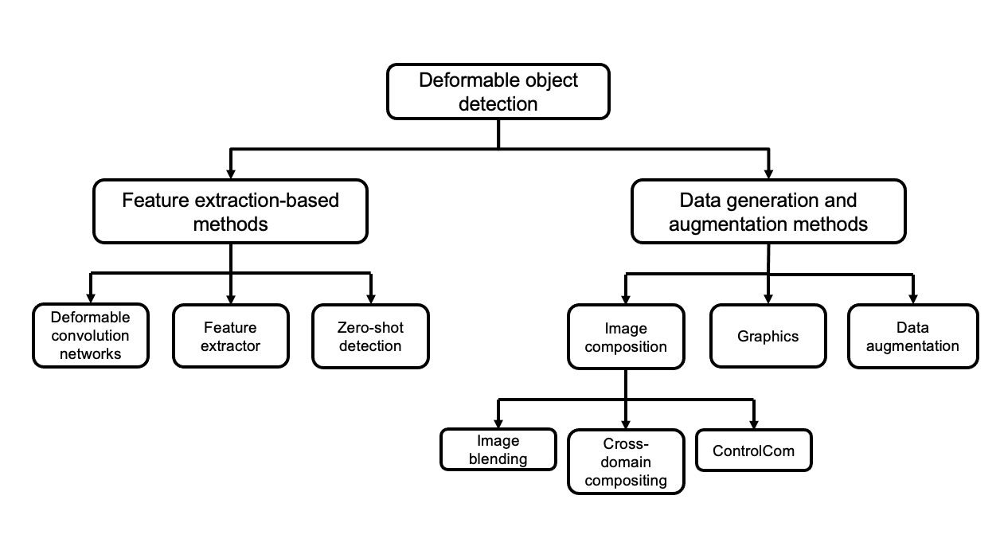

# Robotic Detection of Deformed Objects for Marine Debris Management
This repository contains the resources for methods used in the paper Robotic Detection of Deformed Objects for Marine Debris Management.

## Methods

## Resources
- [YOLACT](https://github.com/dbolya/yolact)
- [YOLO/GELAN](https://docs.ultralytics.com/models/yolov9/)
- [Grounding DINO](https://github.com/IDEA-Research/GroundingDINO)
- [IBURD](https://github.com/8singh/IBURD)
- [Cross-domain Compositing](https://github.com/roy-hachnochi/cross-domain-compositing)
- [ControlCom](https://github.com/bcmi/ControlCom-Image-Composition)
- [DatasetDM](https://github.com/showlab/DatasetDM)

## License
Distributed under the GPL-3.0 license. See `LICENSE.txt` for more information.

<!-- ## Bibliogrphy entry -->
